English | [中文](https://github.com/seriaati/seriaati/blob/main/README_ZH.md)

# Support My Work

If you've found any of my open-source projects helpful, I'd be delighted if you considered expressing your gratitude by making a donation.

Your support not only fuels my passion for coding but also helps sustain my journey as a student and developer.

You can support me via the following methods, different services accept different payment methods:

- [Commission](https://freelance.seria.moe/en): I can help you build Discord bots, web apps, and any kind of software!
- [GitHub Sponsors](https://github.com/sponsors/seriaati): Most preferred because 0% fee, GitHub account needed.
- [Ko-Fi](https://ko-fi.com/seriaati): 3% fee.
- [BuyMeACoffee](https://buymeacoffee.com/seria): 8% fee.
- [Patreon](https://www.patreon.com/seriaati): 10%+ fee.

# About Me

👋 Hi, I'm Seria, an international student from Taiwan, currently studying in Waseda University.  
❤️ I'm also a passionate developer who loves to make open source and high quality software with Python.  
🌍 I speak Chinese and English.  

## Contact Information

You can find me in the following places:  

- [Discord](https://discord.com/users/410036441129943050)
- [Email](mailto:hi@seria.moe)
- [LINE](https://line.me/ti/p/O4Y5UUJSqK)

# Recent Status

## Recent Contributions

- [seriaati/hakushin-py](https://github.com/seriaati/hakushin-py) - Async API wrapper for hakush.in written in Python (`1 day ago`)
- [seriaati/hoyo-buddy](https://github.com/seriaati/hoyo-buddy) - A feature-rich, easy to use, beautifully designed Discord bot made for Hoyoverse gamers (`1 day ago`)
- [seriaati/keni](https://github.com/seriaati/keni) - Open-source AI personal finance tracker (`3 days ago`)
- [seriaati/fxtwitch](https://github.com/seriaati/fxtwitch) - Fix Twitch clip embeds on Discord. (`4 days ago`)
- [seriaati/yatta](https://github.com/seriaati/yatta) - Async API wrapper for Project Yatta (sr.yatta.moe) written in Python (`4 days ago`)

## Recent Stars

- [guillaumemeyer/watermarks-remover](https://github.com/guillaumemeyer/watermarks-remover) - A privacy-first app that strips AI watermarks from content you own. (`2 weeks ago`)
- [twpayne/chezmoi](https://github.com/twpayne/chezmoi) - Manage your dotfiles across multiple diverse machines, securely. (`2 weeks ago`)
- [Lainmode/InstagramEmbed-vxinstagram](https://github.com/Lainmode/InstagramEmbed-vxinstagram) (`3 months ago`)
- [seriaati/keni](https://github.com/seriaati/keni) - Open-source AI personal finance tracker (`4 months ago`)
- [multica-ai/andrej-karpathy-skills](https://github.com/multica-ai/andrej-karpathy-skills) - A single CLAUDE.md file to improve Claude Code behavior, derived from Andrej Karpathy's observations on LLM coding pitfalls. (`4 months ago`)

## Recent PRs

- [ci: add Claude Code auto code review](https://github.com/seriaati/hoyo-buddy/pull/642) on [seriaati/hoyo-buddy](https://github.com/seriaati/hoyo-buddy) (`2 weeks ago`)
- [Try to fix share URL redirect pathing](https://github.com/seriaati/fixthreads/pull/2) on [seriaati/fixthreads](https://github.com/seriaati/fixthreads) (`4 weeks ago`)
- [feat(notif): rework DM notification timing and visibility](https://github.com/seriaati/hoyo-buddy/pull/636) on [seriaati/hoyo-buddy](https://github.com/seriaati/hoyo-buddy) (`1 month ago`)
- [Improve link preview embeds](https://github.com/seriaati/hoyo-buddy-wiki/pull/164) on [seriaati/hoyo-buddy-wiki](https://github.com/seriaati/hoyo-buddy-wiki) (`1 month ago`)
- [Update Geetest server URL](https://github.com/seriaati/hoyo-buddy-wiki/pull/163) on [seriaati/hoyo-buddy-wiki](https://github.com/seriaati/hoyo-buddy-wiki) (`1 month ago`)

# My Projects

- 📋 [Curated list of projects](https://projects.seria.moe)
- 📊 [Uptime and maintenance status](https://status.seria.moe)

# Some Stats

  

