[English](https://github.com/seriaati/seriaati/blob/main/README.md) | 中文

# 支持我

如果我的開源項目對你有所幫助，能收到你的捐款將讓我十分高興（並感謝）。

你的支持不僅激勵了我對程式設計的熱情，還將幫助我繼續作為一名學生和開發者的旅程。

你可以通過以下服務進行捐款，不同服務支持不同付款方式：

- [委託](https://freelance.seria.moe/): 我可以幫你打造 Discord 機器人、網頁應用及各種軟體！
- [GitHub Sponsors](https://github.com/sponsors/seriaati): 最推薦，0% 手續費，需要 GitHub 帳戶。
- [Ko-Fi](https://ko-fi.com/seriaati): 3% 手續費。
- [BuyMeACoffee](https://buymeacoffee.com/seria): 8% 手續費。
- [Patreon](https://www.patreon.com/seriaati): 10%+ 手續費

# 關於我

👋 你好，我是 Seria，一名來自台灣的國際學生，目前在早稻田大學進修。  
❤️ 我同時也是一位充滿熱情的開發者，熱愛使用 Python 開發開源且高品質的軟體。  
🌍 我會說中文和英文。

## 聯絡我

你可以在下列地方找到我:  

- [Discord](https://discord.com/users/410036441129943050)
- [Email](mailto:hi@seria.moe)
- [LINE](https://line.me/ti/p/O4Y5UUJSqK)

# 近況

## 近期貢獻

- [seriaati/hb-site](https://github.com/seriaati/hb-site) - Hoyo Buddy official website (`today`)
- [seriaati/fixthreads](https://github.com/seriaati/fixthreads) - Fixes Meta's Threads metadata for sites like Discord, Telegram, etc. (`today`)
- [seriaati/fxBilibili](https://github.com/seriaati/fxBilibili) - Fix Bilibili link embeds on Discord (`today`)
- [seriaati/Akagi](https://github.com/seriaati/Akagi) - 支持雀魂、天鳳、麻雀一番街、天月麻將，能夠使用自定義的AI模型實時分析對局並給出建議，內建Mortal AI作為示例。 Supports Majsoul, Tenhou, Riichi City, Amatsuki, with the ability to use custom AI models to analyze games in real time and provide suggestions. Comes with Mortal AI as a built-in example. (`today`)
- [seriaati/embed-fixer-site](https://github.com/seriaati/embed-fixer-site) - Official website for Embed Fixer. (`1 day ago`)

## 近期 Stars

- [talwat/lowfi](https://github.com/talwat/lowfi) - An extremely simple lofi player. (`2 days ago`)
- [seriaati/box-com-downloader](https://github.com/seriaati/box-com-downloader) - Download protected files from box.com (`1 week ago`)
- [OliBomby/Mapperatorinator](https://github.com/OliBomby/Mapperatorinator) - An AI framework for generating and modding osu! beatmaps for all gamemodes from spectrogram inputs. (`1 week ago`)
- [seriaati/kamihime-auto](https://github.com/seriaati/kamihime-auto) - 神姬Project 自動化 Kamihime Project game automation bot (`1 week ago`)
- [twpayne/chezmoi](https://github.com/twpayne/chezmoi) - Manage your dotfiles across multiple diverse machines, securely. (`2 months ago`)

## 近期 PR

- [feat(ofiii): add activity](https://github.com/PreMiD/Activities/pull/11279) on [PreMiD/Activities](https://github.com/PreMiD/Activities) (`1 week ago`)
- [v1.16.24 changelog](https://github.com/seriaati/hoyo-buddy-wiki/pull/170) on [seriaati/hoyo-buddy-wiki](https://github.com/seriaati/hoyo-buddy-wiki) (`1 week ago`)
- [docs(changelog): add v1.16.23 release notes](https://github.com/seriaati/hoyo-buddy-wiki/pull/169) on [seriaati/hoyo-buddy-wiki](https://github.com/seriaati/hoyo-buddy-wiki) (`1 month ago`)
- [ci: add Claude Code auto code review](https://github.com/seriaati/hoyo-buddy/pull/642) on [seriaati/hoyo-buddy](https://github.com/seriaati/hoyo-buddy) (`1 month ago`)
- [Try to fix share URL redirect pathing](https://github.com/seriaati/fixthreads/pull/2) on [seriaati/fixthreads](https://github.com/seriaati/fixthreads) (`2 months ago`)

# 我的專案

- 📋 [精心整理過的專案列表](https://projects.seria.moe)
- 📊 [運行狀態與維護資訊](https://status.seria.moe)

# 一些統計數據

  

